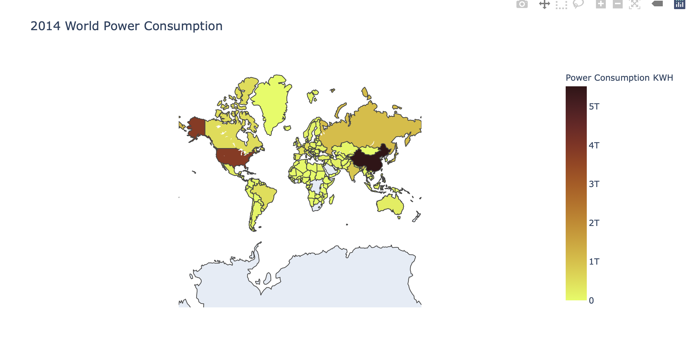
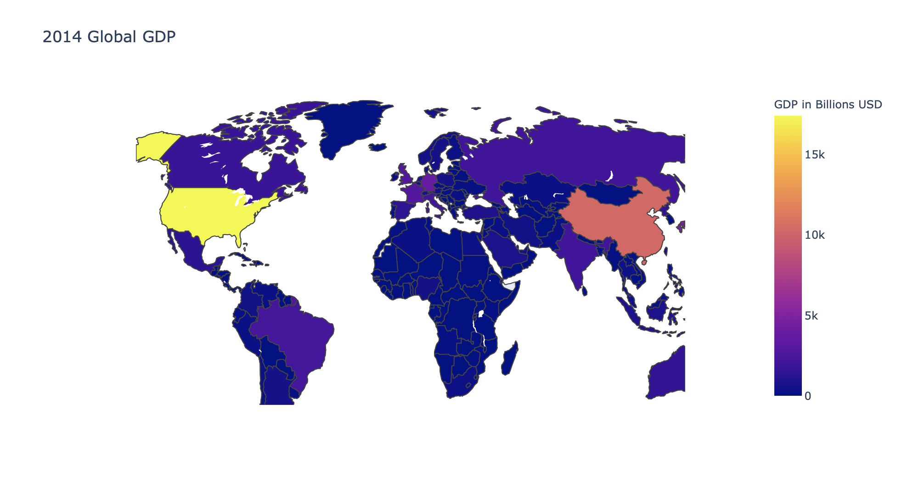
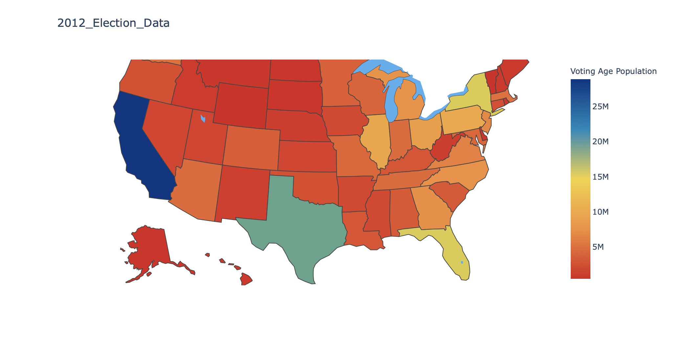
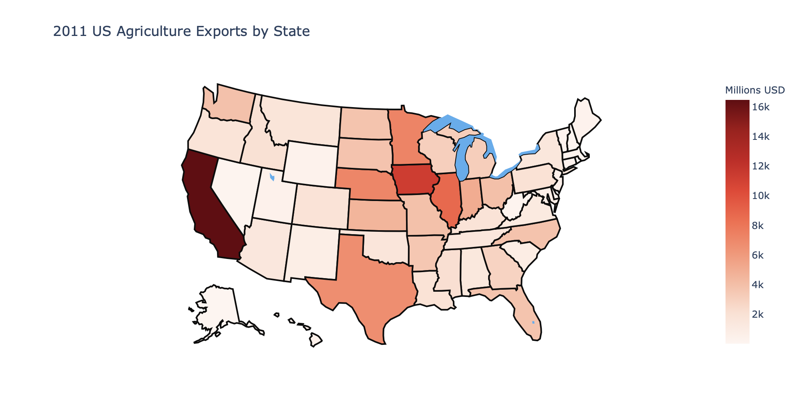

# Cufflinks_and_Plotly
 This project applies Cufflinks and Plotly Data visualisation libraries for Data Analysis and Machine Learning

## Prerequisites 
In order to use Plotly and Cufflinks Data Visualisation libraries, you will first install the following libraries using either `pip` or `conda`.

- `pip install pandas`
- `pip install numpy`
- `pip install matplotlib`
- `pip install plotly`
- `pip install cufflinks`

## Plotly Data Visualisation Examples
This section shows powerful visualisation examples available to visualise Data for effective Data Analysis:

- Plotly Bar Plots

- Plotly Scatter Plots

- Plotly Boxplots

- Plotly Composite Bar_Plots

- Plotly Composite Plots

# Geographical Plotting
Geographically plotting is a challenging one because of the different formats the data can take.

In this section, I showcase some of the examples of the Geographical plotting projects I have done and the applicatiomn of iplot data visualisation.

- Analysis of the World Power Consumption in Year 2014

- Analysis of the World GDP for the Year 2014

- Analysis of Election Data to Identify Voting Age Population for the US 2012 Election

- US Agricultural Exports by States

  