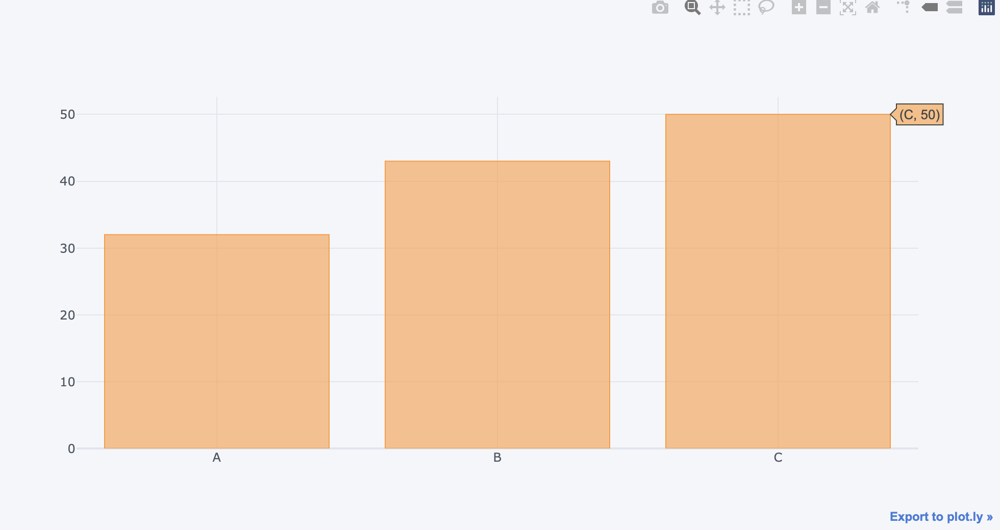
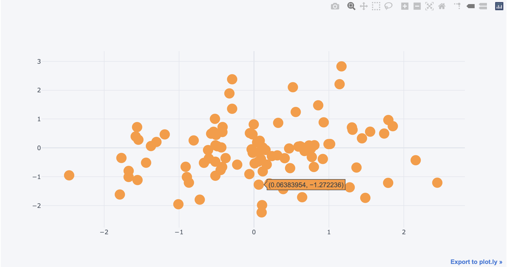
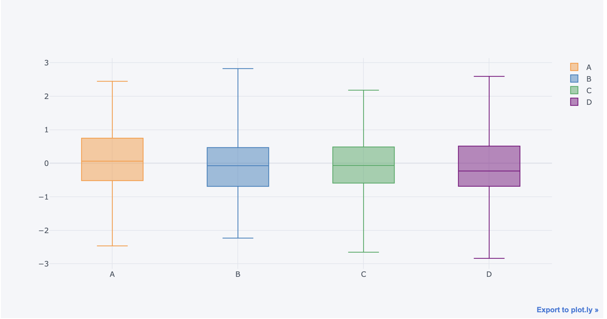
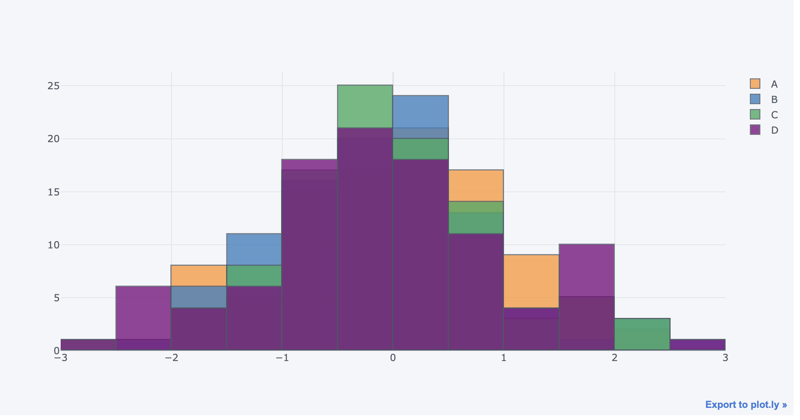
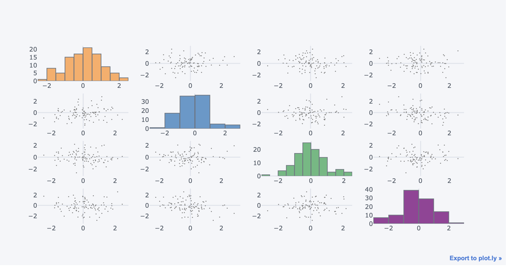

# Cufflinks_and_Plotly
 This project applies Cufflinks and Plotly Data visualisation libraries for Data Analysis and Machine Learning

## Prerequisites 
In order to use Plotly and Cufflinks Data Visualisation libraries, you will first install the following libraries using either `pip` or `conda`.

- `pip install pandas`
- `pip install numpy`
- `pip install matplotlib`
- `pip install plotly`
- `pip install cufflinks`

## Plotly Data Visualisation Examples
This section shows powerful visualisation examples available to visualise Data for effective Data Analysis:

- Plotly Bar Plots

- Plotly Scatter Plots

- Plotly Boxplots

- Plotly Composite Bar_Plots

- Plotly Composite Plots

  